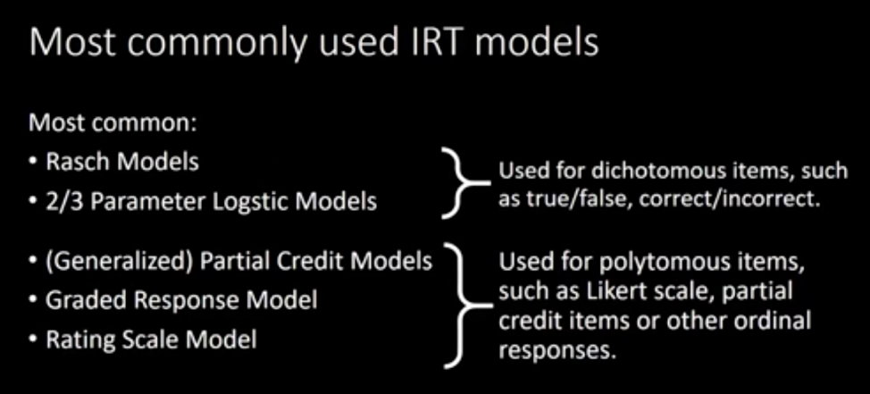

This is an [Item Response Theory in R] Notebook. 

# Basics

### Definition
Item response theory is a family of statistical measurement models, which aim to describe the relationship between a person's response on a given item and the underlying trait the item is used to measure 

More items, make measure items down, better

### Terminology
Item is Indicator in psychology, or Test in education studies

### vs. Classic test theory (CTT)

CTT definition

If item number is limited, the removal of a few screw up the CTT measure, but not that big in IRT


### Types of items vs. types of latent variable
1. items are all binary, latent varials is continous

2. items are all ordinal, latent varials is continous

3. items are binary and ordinal, latent varials is continous

4. 


### Models of IRT
#

1. Rasch models 
2. 2/3 parameter logistic models

Both two are used for dichotomous items

3. (generalized) partial credit models
4. graded response model
5. rating scale model 

The latter three are used for polytomous items such as likert scale, partial credit items or other ordinal responses 

Likert scale
1-4 strongly disagree -- strongly agree
1-4 disagree, somehow disagree, ... agree
the numeric order is quite arbitary


### 3-parameter logitstix models(3PL)

[Here is a 3PL](3PL.png)

```{r}
library(mirt)
library(shiny)
itemplot(shiny= T)

```


```{r}

```


```{r}

```


```{r}

```


# Learning materials

youtube link https://www.youtube.com/watch?v=Sxq3CwHajhM&list=WL&index=12


